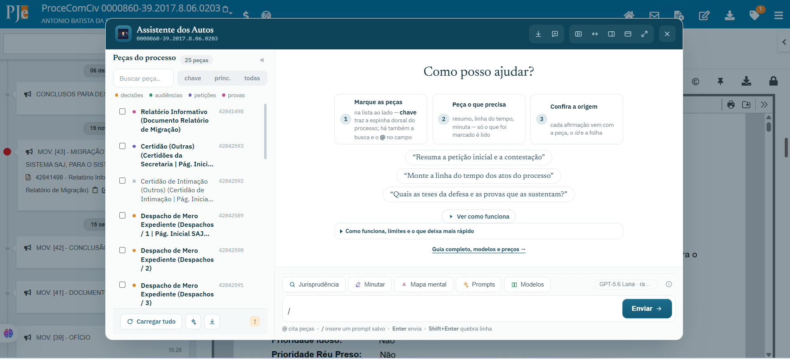
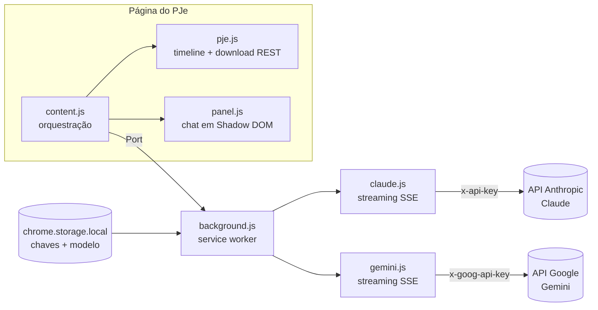

<p align="center">
  
</p>

<h1 align="center">TecJustiça PJe</h1>

<p align="center">
  <em>Análise de autos judiciais com IA — um projeto <a href="https://tecjustica.substack.com/">TecJustiça</a></em>
</p>

<p align="center">
  <a href="https://chromewebstore.google.com/detail/imgfakkieoijdhdpafjjlefcckbmbppm"></a>
  <a href="https://tecjustica.substack.com/"></a>
  <a href="LICENSE"></a>
  
  
  
  
  
  
</p>

**TecJustiça PJe** é uma extensão Chrome que adiciona um assistente de IA à tela de autos digitais
do **PJe (Processo Judicial Eletrônico)**. Você marca as peças do processo, pergunta em
linguagem natural e o modelo — **Claude (Anthropic)**, **Gemini (Google)**, **GPT (OpenAI)** ou qualquer um dos centenas alcançáveis pelo **OpenRouter**, à sua
escolha — responde com base no conteúdo real dos documentos — resumos, linhas do tempo,
partes, pedidos, provas — direto na página do processo, com a interface na paleta visual
do próprio PJe.

<p align="center">
  
</p>

> **Também neste repositório:** **[`pje`](cli/README.md)**, uma ferramenta de
> **linha de comando** que baixa os autos em lote — você passa números CNJ e ela
> grava uma pasta por processo, com as peças separadas e índice, para trabalhar
> fora do navegador. Roda no Windows e no WSL/Linux/macOS.
> [Instalação e conceitos →](cli/README.md)

## 🎯 O que ele é — e o que ele não é

**TecJustiça PJe é um chat simplificado sobre os autos, não um agente autônomo.** Ele não navega
no processo sozinho: **você** seleciona as peças (pelos checkboxes ou digitando `@`) e, a
partir delas, faz perguntas, pedidos e gera documentos. A resposta usa somente os
documentos que você marcou — nada entra no contexto sem a sua escolha.

É um modelo diferente do de um **agente autônomo** — como o **Claude Code** ou agentes
construídos com a **Claude Agent SDK** e frameworks afins — que, conectado a um MCP
jurídico como o [TecJustiça MCP](https://mcp.tecjustica.com/) (demonstração com o PJe-CE
em [pjece.tecjustica.com](https://pjece.tecjustica.com/)), decide sozinho quais peças
abrir, lê os autos por conta própria e gerencia o contexto automaticamente.

| | **TecJustiça PJe (esta extensão)** | **Agente autônomo + MCP** (Claude Code, Agent SDK…) |
|---|---|---|
| Quem escolhe as peças | **Você**, manualmente | O agente decide o que abrir e ler |
| Fluxo | Marcar peças → perguntar → resposta | Delegar a tarefa → o agente navega e itera sozinho |
| Contexto | Limitado à janela do modelo (medidor no rodapé) | Gerenciado automaticamente pelo agente |
| Ideal para | Consultas dirigidas, resumos, relatórios de peças escolhidas | Autos muito volumosos, tarefas abertas de investigação |
| Instalação | Extensão Chrome + chave da API | Ambiente de agente (CLI/SDK) + servidor MCP |

Os dois se complementam: para o dia a dia dentro do PJe, o chat manual é direto e
previsível (você sabe exatamente o que a IA leu); para autos gigantes ou tarefas de
investigação aberta, um agente com MCP é o caminho — o próprio painel sugere o
[TecJustiça MCP](https://mcp.tecjustica.com/) quando o contexto enche.

## ✨ Recursos

### Conversa e modelos

- **Chat sobre os autos** — converse com o modelo sobre as peças selecionadas, com histórico multi-turno e streaming em tempo real (raciocínio do modelo em bloco colapsável).
- **Quatro provedores de IA** — modelos **Claude (Anthropic)**, **Gemini (Google)** e **GPT (OpenAI)** na mesma extensão, mais o **OpenRouter**, um intermediário em que **uma chave** alcança centenas de modelos de vários fornecedores (inclusive os que não estão na lista: basta colar o identificador). Cadastre a chave do provedor que preferir (ou todas) e troque de modelo nas opções. Ver a tabela [Qual modelo escolher?](#-qual-modelo-escolher) abaixo.
- **Selo do modelo ativo** — a barra de ferramentas mostra o modelo e o nível de raciocínio em uso (ex.: "GPT-5.6 Luna · raciocínio alto"), atualizado na hora ao salvar as opções; clique nele para abrir a configuração.
- **Custo por resposta** — o rodapé estima o custo em US$ de cada resposta e o acumulado da conversa, calculado pela tabela de preços do provedor (com o desconto de cache). Pelo **OpenRouter** o valor não é estimado: é o **custo real** debitado, informado pela própria API.
- **Citações com página** *(modelos Claude)* — as afirmações vêm com marcadores `[n]` e a lista de fontes ("Contestação, fl. 12") no rodapé; nos modelos Gemini a citação vem no próprio texto ("conforme a Contestação, fl. 12").
- **Busca de jurisprudência** 🔍 — toggle que libera pesquisa na web (fontes oficiais: STF, STJ, Planalto, LexML…), com a consulta em andamento exibida em tempo real. Nos modelos Gemini usa o Google Search.
- **Minutar** ✍️ *(em todos os provedores)* — peça ao modelo o texto de um ato (despacho, decisão, sentença, parecer…) e ele abre num **editor de texto** próprio, em nova aba, já com a formatação forense (A4, margens 3/2 cm, Times 12, entrelinha 1,5, parágrafos justificados). Do editor você **⎘ copia formatado** para colar no editor de minutas do PJe, **⬇ baixa em `.docx`** (Word, gerado no próprio navegador) ou **🖨 imprime/salva em PDF**. Toda afirmação leva a origem `(peça · id · fl.)` e o que faltar nas peças vira `[COMPLETAR: …]`. Toda resposta longa do chat também ganha um botão **Abrir no editor**. O rascunho fica guardado no computador (7 dias) para reabrir depois.
- **Mapa mental** 🧠 *(em todos os provedores)* — o modelo organiza as peças marcadas nos eixos da análise processual (partes, fatos, pedidos, teses, provas, audiências, decisões, prazos, situação) e a extensão abre um **mapa interativo** em nova aba (markmap): cada eixo com ícone e cor próprios, **tabelas** onde a informação é tabular, **pílulas** de folha, id da peça, data, valor e norma, e a origem (`peça · id · fl.`) em cada tópico. Nasce recolhido, com níveis de detalhe, zoom, tema escuro, impressão/PDF e download do texto em `.md`.
- **Biblioteca de prompts** ✦ — salve instruções que você repete (título + texto) e insira-as digitando **`/`** no início do campo: o prompt vira um chip elegante acima da caixa de texto e é enviado antes da sua mensagem. Gerenciamento (criar/editar/excluir) no botão **✦ Prompts**, e os prompts acompanham você em outros navegadores pela sincronização da conta Google.
- **Peça digitalizada também é lida** — a peça que é imagem (documento escaneado, foto anexada, print) vai ao modelo **como imagem** e é lida por ele, sem OCR externo. E quando você **extrai o texto** para fora da extensão, entra um **OCR local** que roda no seu próprio computador — ver [Levar os autos para fora](#levar-os-autos-para-fora).

### Seleção de peças

- **Checkboxes por documento** — só o que você marcar é enviado; chips acima do campo mostram as peças no contexto (com `×` para remover) e o contador indica `x/y`.
- **Seleção em faixa: arrastar, `Shift+clique` e botão direito** — marcar quarenta petições em sequência não custa quarenta cliques. **Arrastar** sobre a lista marca todas por onde o ponteiro passar (inclusive a peça de origem); **`Shift+clique`** marca do último item tocado até este; e o **botão direito** abre *marcar daqui para baixo / para cima*, que resolve quando a outra ponta do intervalo está fora da tela. Os três respeitam a busca ativa.
- **Três degraus de seleção — `chave | principais | todas`** — degraus encaixados, do mais enxuto ao mais amplo. **chave** traz a espinha dorsal do processo (petição inicial, contestação, réplica, saneador, laudo, ata de instrução, memoriais, sentença, acórdão e recursos): num processo de 200 peças costumam ser cerca de uma dúzia, e são elas que respondem a maioria das perguntas. **principais** acrescenta as demais peças de conteúdo — decisões, audiências, petições e provas —, deixando de fora o expediente (certidões de intimação, avisos de recebimento, guias, procurações). **todas** marca a lista inteira. Os três somam à seleção, nunca desmarcam o que você escolheu à mão, e respeitam a busca ativa.
- **✨ Escolher com IA** — quando o título das peças não basta (sete "Petição" seguidas, um "Documento 3"), envia à IA só a **lista** — id, título, tipo e data, nenhum conteúdo — e deixa que ela escolha. Se houver uma pergunta escrita no campo, a escolha é feita para **aquela** pergunta; vazio, ela escolhe as peças que descrevem o processo. Custa alguns centavos, leva poucos segundos, e o motivo de cada peça aparece ao passar o mouse.
- **Peças categorizadas por cor** — decisões (dourado), audiências (verde), petições (roxo) e provas (magenta) ganham destaque automático, com vocabulário criminal (inquérito, flagrante, interrogatório, pronúncia…) e cível (reconvenção, acordo, quesitos…).
- **Busca na lista** — filtro instantâneo por título **e pelo tipo oficial da peça**, ignorando acentos (buscar "despacho" acha a peça cujo arquivo se chama "Documentos diversos").
- **Menção com `@`** — digite `@` no campo de pergunta para buscar e marcar peças sem sair do teclado (`↑↓` navega, `Enter` marca, `Esc` fecha).
- **⟳ Carregar todas as peças** — o PJe só carrega os documentos conforme a linha do tempo é rolada; o botão rola tudo automaticamente para a lista ficar completa.
- **Preview no hover** — nos modos largos, passar o mouse numa peça abre a pré-visualização do PDF/texto; "Abrir documento" busca peças ainda não carregadas.
- **Ver na timeline** — cada peça tem um botão que localiza e destaca o documento na linha do tempo do PJe.

### Levar os autos para fora

Nem todo trabalho acontece dentro do painel. Estas saídas existem para levar o
processo inteiro para outra ferramenta — o Claude Code, um script, um arquivo de
caso — sem depender da extensão para lê-lo depois.

- **⬇ Baixar as peças em `.zip`** — o processo inteiro num pacote, uma peça por arquivo, nomeadas `NNN_Titulo_ID.ext`: o número é a **posição cronológica**, então a ordem alfabética da pasta é a ordem dos autos, e o **id fica no nome** porque é o único metadado que sobrevive a sair da ferramenta. Vem com `LEIA-ME.md`, `indice.txt` e `indice.json` — a ficha do processo, quem juntou cada peça, quantas páginas tem, e o formato de citação para usar depois.
- **📄 Extrair só o texto** — o mesmo processo em **texto puro**, para alimentar outra ferramenta sem carregar PDF. Dois formatos, no menu do `⬇`: **um `.md` só** com o processo inteiro (`# peça` / `## Página N`), ou **um `.md` por peça** dentro de um `.zip`, com `indice.md` (tabela com link para cada arquivo), `indice.json` e identificação em cada peça — este último é o que permite pedir *"leia só a contestação"* em vez de carregar os autos completos. O pacote leva o arquivo único **junto**, então escolher um formato nunca custa o outro.
- **Modo sigiloso: anonimização local** 🔒 — em processo em segredo de justiça, ligue o
  botão e as peças passam a viajar como **texto com os dados pessoais mascarados**, lidos e
  reconhecidos **no seu próprio computador**; o PDF não sai da máquina. Datas, prazos e
  legislação são preservados. Antes de cada envio a extensão confere o que sairia e recusa
  se algo escapou — ver [Processo em segredo de justiça](#️-processo-em-segredo-de-justiça-anonimize-antes).

- **OCR local nas páginas digitalizadas** — na extração, a folha que **não tem camada de texto** passa por um reconhecimento que roda **no seu computador** (PP-OCRv6 sobre ONNX Runtime; a extensão mede WebGPU e WebAssembly na primeira página e fica com o mais rápido). Anexo em foto ou print também passa. Nenhum byte vai para serviço de OCR nenhum. Cada página reconhecida vem **marcada no arquivo, com a confiança** — OCR erra, e quem assina precisa saber o que conferir.
- **📦 Pacote de carta precatória** — para cada carta precatória **expedida**, uma pasta com a carta, a peça de **origem** da ação e a **decisão que a fundamenta**, no **PDF oficial** do tribunal (com timbre e assinatura), pronta para virar um envio de malote digital. A escolha é feita pelo **movimento processual** — vocabulário CNJ, controlado — e não pelo título da peça, que costuma ser o nome do arquivo que alguém subiu; e a extensão **mostra o que encontrou para você conferir** antes de gerar o pacote.
- **`pje`, pela linha de comando** — para baixar autos em lote fora do navegador, passando números CNJ. Ver [`cli/README.md`](cli/README.md).

### Contexto, custo e confiabilidade

- **Medidor de contexto dinâmico** — barra mostra quanto da janela do modelo (tokens e páginas de PDF) a conversa ocupa, atualizada ao marcar/desmarcar peças **antes mesmo do envio**, com alertas em 70% e 90%. Desmarcar uma peça **libera contexto de verdade** no request seguinte.
- **Files API + anexo incremental** — cada peça sobe uma única vez; os turnos seguintes reaproveitam o que já está na conversa.
- **Cache automático** — os PDFs anexados são cacheados pela API (~90% mais barato nos turnos seguintes), nos provedores diretos.
- **Retry automático** — sobrecarga da API, limites momentâneos e quedas de conexão no meio do streaming são re-tentados sozinhos, sem duplicar texto na tela.
- **PDF × HTML detectados automaticamente** — peças HTML viram texto puro (fração do custo de um PDF); a detecção confere o content-type **e** a assinatura `%PDF-` do binário.
- **Erros amigáveis** — chave inválida, conta sem crédito, limites e sobrecarga explicados em português.
- **Memória de processos** — reabrir um processo já analisado **retoma a conversa e não baixa as peças de novo**. Isso não é conveniência: o download do PJe é serializado, e num processo de 200 peças a diferença é de minutos. O banco é local e vive na origem da **extensão**, nunca na do tribunal; desligar a memória nas opções **apaga tudo na hora**.
- **A linha do tempo do processo vai junto das peças** — publicação, intimação, decurso de prazo e trânsito em julgado quase nunca viram peça com texto: são **movimentos**. A extensão lê o registro oficial do PJe e envia os movimentos com data (e hora, quando existe) — sem isso, perguntar a data do trânsito devolvia *"não é possível determinar com segurança"*, e a resposta estava certa, porque o dado nunca havia sido enviado. Um selo no rodapé diz quantos movimentos foram e de que fonte, e **abre a lista** para você conferir.

### Interface

- **Visita guiada no primeiro uso** — na primeira vez, o painel oferece um passeio de treze passos desenhado **sobre a própria interface**, com o gesto **animado ao lado**: a mão descendo pela lista e marcando a faixa, o menu do botão direito abrindo, as peças acendendo enquanto a IA ainda escolhe. Sete dos treze passos são sobre **marcar peças**, que são os atalhos que quase ninguém descobre sozinho. Ela **não altera nada** no seu processo (os gestos são demonstrados numa lista de exemplo) e abre uma vez só — depois fica no botão **Ver como funciona**, no início de toda conversa nova.
- **Quatro modos de painel** — flutuante, expandido, tela cheia e **lateral** (o processo fica visível e clicável ao lado do chat).
- **Ocultar a lista de peças** — nos modos expandido/tela cheia, um botão no cabeçalho colapsa a coluna de documentos para dar todo o espaço ao chat (a seleção continua valendo).
- **Progresso por peça** — card com o estado de cada peça (aguardando → baixando → pronta) ao preparar a análise.
- **Respostas formatadas** — markdown completo: tabelas, listas, títulos e citações.
- **Exportar a conversa** — baixe o diálogo em `.md` ou copie cada resposta com um clique.

## 🧠 Qual modelo escolher?

| Modelo | Janela / PDF | Preço (US$/1M tokens) | Perfil |
|---|---|---|---|
| **GPT-5.6 Luna** (padrão) | 1,05M tokens | 0,20 / 1,20 | O mais barato dos de janela grande; citações no texto |
| **Claude Haiku 4.5** | 200 mil / 100 págs. | 1 / 5 | Rápido e barato; citações `[n]` clicáveis |
| **Claude Sonnet 5** | 1M / 600 págs. | 3 / 15 | Autos volumosos; todos os recursos |
| **Claude Opus 4.8** | 1M / 600 págs. | 5 / 25 | Qualidade superior para análises delicadas |
| **Claude Fable 5** | 1M / 600 págs. | 10 / 50 | O mais capaz — e o mais caro e lento |
| **Gemini 3.8 Flash** | 1M / 1000 págs. | 1,50 / 7,50 | O Gemini mais novo (09/2026) e o indicado do provedor |
| **Gemini 3.7 Flash** | 1M / 1000 págs. | 1,50 / 7,50 | Rápido e direto; o único Gemini medido em uso real para redigir |
| **Gemini 3.6 Flash** | 1M / 1000 págs. | 1,50 / 7,50 | A geração anterior do Flash, ainda disponível |
| **Gemini 3.5 Flash-Lite** | 1M / 1000 págs. | 0,30 / 2,50 | O mais barato e veloz — triagens e resumos |
| **GPT-5.6 Terra** | 1,05M tokens | 2 / 12 | GPT equilibrado entre custo e capacidade; citações no texto |
| **GPT-5.6 (Sol)** | 1,05M tokens | 5 / 30 | O GPT mais capaz; citações no texto |
| **Pelo OpenRouter** | depende do modelo | o do modelo | Não é um modelo: é o caminho para usar **centenas deles** com uma chave só. Custo **real**, não estimado |

> Nos modelos Gemini e GPT, as citações de página vêm no próprio texto (sem os marcadores `[n]` clicáveis) — essa é a única diferença; minutar e o mapa mental funcionam igual em todos os provedores. Trocar de provedor no meio de uma conversa pede "Nova conversa".
>
> **Pelo OpenRouter** valem duas diferenças a mais: as peças são **reenviadas a cada mensagem** (ele não guarda os documentos entre as perguntas), então em processos grandes marque menos peças por conversa; e, como ali quem escolhe a empresa que atende o pedido é o intermediário, a extensão exige em **todo envio** fornecedores que **não retenham os dados** para treino — autos não podem virar material de treinamento.

## 🚀 Instalação

<p align="center">
  <a href="https://chromewebstore.google.com/detail/imgfakkieoijdhdpafjjlefcckbmbppm">
    
  </a>
</p>

**A extensão está na Chrome Web Store.** É o caminho recomendado: um clique, e o
Chrome passa a atualizá-la sozinho.

1. **[Instale pela Chrome Web Store](https://chromewebstore.google.com/detail/imgfakkieoijdhdpafjjlefcckbmbppm)**.
2. Clique no ícone **TecJustiça PJe** na barra do Chrome, cole sua chave de API — da
   **OpenAI** (modelos GPT), da **Anthropic** (modelos Claude) e/ou do **Google**
   (modelos Gemini) — escolha o modelo e salve.
   - Não tem chave? O popup traz um **guia passo a passo**, com o endereço do console de
     cada provedor: [platform.openai.com](https://platform.openai.com/api-keys),
     [console.anthropic.com](https://console.anthropic.com/settings/keys) e
     [aistudio.google.com](https://aistudio.google.com/apikey).

<details>
<summary><b>Prefere instalar pelo <code>.zip</code>, em modo desenvolvedor?</b> (para testar uma versão antes de ela chegar à Store, ou onde a Store é bloqueada)</summary>

<br>

1. **[Baixe o pje-ia.zip](https://github.com/marcosmarf27/pje-ia/releases/latest/download/pje-ia.zip)** (última versão) e **extraia** para uma pasta fixa (ex.: `Documentos\pje-ia`).
   - O Chrome carrega a extensão dessa pasta — não a apague depois.
2. Abra `chrome://extensions` e ative o **Modo do desenvolvedor** (canto superior direito).
3. Clique em **Carregar sem compactação** e selecione a pasta extraída (a que contém o `manifest.json`).
4. Configure a chave como no passo 2 acima.

**Para atualizar por este caminho:** baixe o novo `.zip`, extraia por cima da mesma pasta e
clique em **↺ Atualizar** em `chrome://extensions`. Ao contrário da Store, aqui a
atualização é manual. (Quem preferir pode usar `git clone` + carregar a pasta do
repositório.)

</details>

## ⌨️ `pje` — baixar autos em lote pela linha de comando

Junto da extensão vive uma ferramenta **separada**, para quem precisa dos autos
**fora** do navegador — num script, numa pasta de caso, no Claude Code. Você
passa números CNJ e ela grava uma pasta por processo, com as peças separadas e
índice.

```
pje login --sessao-atual                  # aproveita a sessão já aberta no seu navegador
pje baixar 0000000-00.0000.0.00.0000
pje baixar 0000000-00.0000.0.00.0000      # de novo: busca só o que apareceu depois
```

Instalação em uma linha — **Windows:**

```powershell
irm https://raw.githubusercontent.com/marcosmarf27/pje-ia/main/instalar.ps1 | iex
```

**WSL, Linux ou macOS:**

```sh
curl -fsSL https://raw.githubusercontent.com/marcosmarf27/pje-ia/main/instalar.sh | sh
```

Sem dependências, sem `npm install` (Node 22+). O pacote sai **idêntico** ao do
botão ⬇ do painel, porque é o mesmo `src/exportar.js` — e por isso rodar os dois
sobre o mesmo processo é um teste de que não divergiram.

> **A sessão do PJe é uma credencial ao portador.** Quem tiver o arquivo entra no
> PJe como você. Ele fica fora do repositório, o valor do cookie nunca aparece em
> saída nenhuma, e `pje logout` apaga. **Leia o [`cli/README.md`](cli/README.md)**
> — ele explica os conceitos de sessão, o incremental, os limites conhecidos e
> por que um `403` normalmente significa *peça cancelada*, não falta de permissão.

A extensão **não é tocada** por nada disso: o CLI só **lê** `src/exportar.js`, e
`empacotar.ps1` copia apenas `manifest.json`, `src/`, `icons/` e `vendor/` —
então `cli/` fica fora do pacote da Web Store por construção.

## 📖 Como usar

1. Faça login no PJe e abra os **autos de um processo** (tela da linha do tempo de documentos).
2. Clique no botão **⚖️ Analisar com IA** no canto inferior direito da página.
3. Clique em **⟳ Carregar todas as peças** (abaixo da lista) — o PJe só carrega os documentos conforme a linha do tempo é rolada; sem esse passo a lista pode estar incompleta.
4. Marque as peças da análise — **chave** traz a espinha dorsal do processo de uma vez, **principais** acrescenta as demais peças de conteúdo e **todas** marca tudo; **✨ Escolher com IA** decide por você quando os títulos não bastam. A busca e o **`@`** no campo acham peças pelo nome ou pelo tipo (ex.: `@contestação`).
5. Pergunte — por exemplo:
   - *"Resuma o pedido da inicial e os argumentos da contestação"*
   - *"Monte uma tabela com a linha do tempo dos atos"*
   - *"Quais provas foram juntadas e o que cada uma demonstra?"*
6. Siga a conversa: **adicionar** peças no meio é barato (aproveita o cache); para **remover** várias ou mudar de assunto, prefira **⟲ Nova conversa**. O medidor e o custo ficam no rodapé; o selo mostra o modelo ativo.

**Atalhos:** `@` cita peças no campo · `/` insere um prompt salvo · `Enter` envia · `Shift+Enter` quebra linha · com os popups `@` e `/` abertos: `↑↓` navega, `Enter`/`Tab` seleciona, `Esc` fecha · botões do cabeçalho: `⇄` painel largo, `▯` lateral, `⤢` tela cheia, `▤` oculta/exibe a lista de peças (modos largos), `↺` nova conversa.

### ✦ Prompts salvos: escreva a instrução uma vez, use sempre

Aquelas instruções que você repete em todo processo (relatório de audiência, linha do
tempo dos atos, análise de prescrição) viram **prompts salvos**. Digite **`/`** no
início do campo de mensagem, busque pelo título e selecione: o prompt entra como um
**chip** acima da caixa de texto — passe o mouse nele para reler o texto completo — e é
enviado antes do que você escrever na hora. Para criar, editar ou excluir, use o botão
**✦ Prompts** na barra de ferramentas (ou a linha *Gerenciar prompts…* do próprio
popup). Eles ficam no `chrome.storage.sync`, então acompanham você em qualquer Chrome
logado na mesma conta Google.

<p align="center">
  
</p>

### 🧠 Mapa mental: o processo inteiro numa página

Quando o que você precisa é **enxergar a estrutura** do feito — e não ler mais um
relatório —, marque as peças e clique em **🧠 Mapa mental**. A instrução padrão
(editável, como ao minutar) aparece no campo e o botão Enviar vira **Gerar mapa**;
a resposta abre em **nova aba** como um mapa interativo, com o número do processo no
centro e um ramo por eixo (partes, fatos, pedidos, teses, provas, situação atual).

O mapa nasce **recolhido**: clique num círculo para abrir o ramo, use os botões de
**detalhe 1/2/3/Tudo** para abrir vários de uma vez, arraste para mover, role para
dar zoom. Cada eixo tem ícone e cor próprios (a mesma paleta das categorias de peças),
e o que é tabular — partes, linha do tempo — vira **tabela** dentro do nó. Folhas,
ids de peça, datas, valores e artigos ganham **destaque colorido**.

**Toda afirmação aponta a origem**: cada tópico traz, em linha própria, a peça, o
**id do documento** (o número que abre o título da peça na timeline do PJe) e a
**folha** — é assim que você reencontra o trecho nos autos. O cabeçalho mostra
quantos tópicos vieram com peça e folha. Ainda dá para alternar o **tema escuro**,
baixar o texto em **`.md`** e **imprimir** (ou salvar em PDF, já enquadrado).

> O mapa mental funciona **em todos os provedores** — Claude, Gemini, GPT e os do OpenRouter —, porque é um
> chat comum, sem execução de código. Os mapas ficam disponíveis enquanto o
> navegador estiver aberto.

<p align="center">
  
</p>

### ✍️ Minutar: da análise ao ato, num editor de verdade

O chat explica o processo; **minutar** escreve a peça. Marque os documentos, clique em
**✍️ Minutar** (a instrução padrão, editável, aparece no campo) e o modelo redige o ato
cabível — despacho, decisão, sentença, parecer. A resposta abre em **nova aba** num
**editor WYSIWYG** ([Jodit](https://xdsoft.net/jodit/)) já com a formatação forense:
A4, margens 3/2 cm, Times 12, entrelinha 1,5, títulos centralizados e parágrafos
justificados com recuo de primeira linha.

No editor você revisa, ajusta e então:

- **⎘ Copia formatado** — leva o texto rico para a área de transferência, pronto para
  colar no editor de minutas do PJe sem perder títulos, negrito e justificação;
- **⬇ Baixa `.docx`** — Word de verdade, gerado **no próprio navegador**
  ([docx](https://docx.js.org)), com as mesmas medidas da tela (tabelas nativas,
  numeração, estilos de título);
- **🖨 Imprime / salva em PDF** — pelo diálogo nativo do Chrome, só a folha.

**Toda afirmação leva a origem** `(Peça, id 123456, fl. 7)` e, onde falta dado nas peças,
o modelo deixa `[COMPLETAR: …]` para quem assina preencher — nada de número, data ou
precedente inventado. O rascunho fica **guardado no computador por 7 dias** para você
reabrir e continuar; **Descartar**, no editor, apaga na hora. Como o mapa, minutar é um
chat comum: funciona **em qualquer modelo**, Claude, Gemini ou GPT.

> A minuta é uma sugestão de trabalho, não um ato: revise o texto e confira as citações
> nos autos antes de usar.

#### 📚 Modelos: a minuta sai no **seu** formato

Cada gabinete tem seu jeito de escrever. Em **📚 Modelos** você cadastra as suas
peças-modelo — sentenças, decisões, despachos, ofícios, atas, mandados — organizadas por
espécie. Ao ligar o modo minuta, escolha a espécie em **Seguir modelos** e o assistente
recebe as suas peças daquela categoria: ele analisa, adota como base a mais adequada ao
caso e aproveita a estrutura das seções, as fórmulas de praxe e o linguajar das demais.

**Já tem as peças no Word? Arraste todas de uma vez.** Em **Importar .docx** você solta
5, 10, quantos arquivos quiser: cada um vira uma ficha já preenchida — o título sai do
nome do arquivo e a **espécie é reconhecida pelo conteúdo** (o cabeçalho e o fecho da
peça denunciam o que ela é: um "Publique-se. Registre-se." é sentença; um "Cite-se. Ao
contador." é despacho). Você confere e corrige o que quiser, e um clique cadastra todas.
Os arquivos são lidos **no seu próprio computador** — não sobem para lugar nenhum — e
nada é gravado sem a sua conferência.

**Os fatos nunca vêm do modelo.** O texto que você cadastra entra no pedido numa moldura
com regra expressa de que serve **só de forma**: nome de parte, valor, data, dispositivo
ou fundamento saem exclusivamente das peças do processo em tela — o que faltar vira
`[COMPLETAR: …]`, como sempre. Quanto mais modelos da mesma espécie você cadastrar,
melhor o assistente capta o seu estilo.

Os modelos ficam **só neste navegador** (não sincronizam) e você os apaga quando quiser
pela própria biblioteca. Como a minuta manda os autos inteiros **mais** os seus modelos,
o recurso exige um modelo de IA com janela de **1 milhão de tokens** — o modelo padrão
(GPT-5.6 Luna) atende, e no Haiku 4.5 o botão fica desativado, explicando o porquê.

<p align="center">
  
</p>

<!-- VITRINE: grave a tela "✍️ Minutar → Gerar minuta → editor" e salve como docs/minutar.gif;
     depois troque este comentário pelo bloco abaixo:
<p align="center">
  
</p>
-->

### 🏛️ Todos os tribunais, sem configurar nada

A extensão funciona em **qualquer tribunal que rode PJe** (TJs, TRFs, TRTs — 1º ou 2º
grau, incluindo o PJe na nuvem do CNJ em `*.cloud.pje.jus.br`), automaticamente: a
permissão cobre todos os sites da Justiça (`https://*.jus.br`) desde a instalação.
O botão **⚖️ Analisar com IA** aparece sozinho quando você abre a tela de autos
digitais de um processo — em páginas que não são de autos (login, portais), a
extensão não injeta nada.

> A compatibilidade depende de o tribunal usar a tela de autos padrão do PJe
> (linha do tempo + endpoint de download `pje-legacy`) — o caso da grande maioria
> das instalações do CNJ.

<p align="center">
  
</p>

## 🏗️ Arquitetura



| Módulo | Papel |
|---|---|
| `src/pje.js` | Lista as peças na timeline e baixa cada uma pelo endpoint REST do PJe (sessão do usuário). Ativa peças "não abertas" automaticamente. |
| `src/panel.js` / `panel.css` | UI do chat em Shadow DOM (isolada do CSS do PJe): seletor de peças, menção `@`, prompts salvos `/`, chips de contexto, card de progresso e renderizador markdown próprio e seguro. |
| `src/prompts.js` | Biblioteca de prompts do usuário: CRUD no `chrome.storage.sync` (um item por prompt), sincronizado entre os navegadores da mesma conta Google. |
| `src/content.js` | Orquestra: downloads paralelos, cache por peça, prompt caching, conversa multi-turno. |
| `src/background.js` + `claude.js` / `gemini.js` / `openai.js` | Service worker que guarda as chaves e chama a API do provedor do modelo escolhido (Anthropic, Google ou OpenAI) com streaming. **As chaves nunca são expostas à página.** |
| `src/casodb.js` + `caso.js` | **Memória de processos**: banco local (IndexedDB) que guarda o texto das peças, a conversa e a seleção de cada processo, para reabrir sem baixar tudo de novo. O banco vive no *service worker* — na origem da extensão, nunca na do tribunal —, e `caso.js` é o cliente que o content script usa. |
| `src/mapa.html` + `mapa.js` / `mapa.css` | Página do **mapa mental**: converte o Markdown da resposta em árvore de nós (com ícones por eixo, tabelas e realces de fl./id) e desenha com markmap (d3), em aba própria da extensão. |
| `vendor/` | Bibliotecas de terceiros oficiais, **sem modificação**: `d3` + `markmap-view` (mapa mental), `jodit` (editor de minutas), `docx` (geração do `.docx`), `pdf.js` (leitura das páginas na extração) e o runtime de OCR com o modelo PP-OCRv6. **Nenhuma delas é carregada nas páginas do tribunal** — todas vivem em páginas ou contextos internos da extensão. Licenças em `vendor/LICENSES.md`. |
| `src/popup.html` | Configuração em 1 clique no ícone da barra (chave, modelo, guia de primeiros passos). |
| `src/exportar.js` + `zip.js` | **Empacotamento**: monta o `.zip` das peças, o pacote de texto e os índices. `zip.js` é um escritor de ZIP próprio (~200 linhas, sem biblioteca de terceiros) e `exportar.js` é um módulo **puro** — não conhece o painel nem o PJe, o que o torna testável fora do navegador e reutilizável pelo `pje` da linha de comando. |
| `src/ocr-render.js` + `ocr-offscreen.js` | **OCR local**. O `pdf.js` roda num iframe interno (`ocr-render.js`) e o motor de reconhecimento, num documento *offscreen* (`ocr-offscreen.js`) — a divisão não é estética: o `render()` do pdf.js trava em qualquer contexto que não pinta, e o *service worker* não cria Web Workers. |
| `src/precatoria.js` | **Pacote de carta precatória**: identifica as cartas expedidas pelo **movimento processual** (vocabulário CNJ) e reúne a carta, a peça de origem e a decisão que a fundamenta. |
| `src/editor.html` + `editor.js` / `editor-docx.js` / `minuta-md.js` | Página do **editor de minutas**: converte o Markdown do modelo em documento com formatação forense, e gera o `.docx` **no próprio navegador**. |
| `src/modelos.js` + `modelos.html` / `docx-importar.js` | **Biblioteca de peças-modelo** e a importação em lote de `.docx`/`.rtf`, lidos dentro do navegador (sem enviar o arquivo a lugar nenhum). |
| `src/tour.js` | Visita guiada de primeiro uso, desenhada **sobre o painel real** — os gestos são demonstrados num palco de exemplo, para a visita nunca marcar peças nem disparar downloads de verdade. |

## 🔒 Privacidade e segurança

- As chaves de API ficam **somente** no `chrome.storage.local` do seu navegador (não sincronizam, não passam por servidores de terceiros).
- Os documentos marcados são enviados **diretamente à API do provedor do modelo escolhido** (Anthropic, Google ou OpenAI) — nenhum outro serviço intermedia.
- A extensão só roda em sites da Justiça (`*.jus.br`), só injeta o painel em telas de autos do PJe e não coleta telemetria.
- A **memória de processos** grava, neste computador, o texto das peças e a conversa de cada processo — **nunca os PDFs nem as imagens**. Apaga-se sozinha em 14 dias, tem um botão **Esquecer este processo** na própria conversa e pode ser desligada por completo na configuração.
- O **OCR das páginas digitalizadas roda no seu computador**: o modelo vem dentro da extensão e a imagem da folha não é enviada a serviço nenhum — nem de OCR, nem de IA. Pela mesma razão, a **extração do texto** e o **`.zip` das peças** não passam por servidor algum: o único acessado é o do próprio tribunal, com a sua sessão.
- Política completa em [PRIVACY.md](PRIVACY.md) — sem servidor próprio, sem analytics, o desenvolvedor nunca tem acesso a nenhum dado.

> ⚠️ **Aviso legal:** autos judiciais podem conter dados pessoais e sigilosos. O uso da
> extensão — e o envio de peças a um provedor de IA — é de responsabilidade do usuário,
> observadas as normas do tribunal, a LGPD e eventuais segredos de justiça. As respostas
> da IA são apoio à leitura, **não substituem** a análise jurídica humana.

### 🛡️ Processo em segredo de justiça: anonimize antes

O **art. 19, §3º, IV** da Resolução CNJ 615/2025 veda usar IA privada ou externa para
processar documentos sigilosos ou em segredo de justiça — **salvo** anonimização na
origem. Esta extensão é solução privada e externa (usa a sua chave de uma API comercial),
então, nesses processos, o caminho é anonimizar o documento **antes** de ele sair do seu
computador.

Desde a **v0.55 isso é da própria extensão**: ligue o botão **🔒 Sigiloso** na barra de
ferramentas do painel e as peças passam a ser **lidas e anonimizadas no seu computador**
antes de qualquer envio. Nomes, CPF, CNPJ, RG, OAB, e-mail, telefone, CEP e o número do
processo viram rótulos estáveis (`[PESSOA_1]`, `[CPF_2]` — a mesma pessoa tem o mesmo rótulo
em todas as peças), e o **PDF não sai da máquina**: o que viaja é só o texto mascarado.

- **Duas camadas.** Detectores determinísticos (CPF e CNPJ conferidos pelo **dígito
  verificador**, OAB, e-mail, telefone, CEP com âncora de contexto, mais os nomes das partes
  lidos da própria ficha do processo) e um **modelo de reconhecimento de nomes que roda no
  seu navegador** (BERT em português treinado no LeNER-Br, embutido no pacote). Nenhum
  serviço externo é consultado para anonimizar.
- **Datas, prazos, legislação e jurisprudência são preservados**, de propósito: mascará-los
  destruiria a utilidade jurídica do documento sem proteger ninguém.
- **Barreira final.** Antes de cada envio a extensão **confere o que sairia** e recusa o
  envio se algum valor original tiver escapado — o turno inteiro é bloqueado, nada vai pela
  metade. A bolha mostra o valor e onde ele estava e pergunta se é um dado pessoal: manter
  protegido e reenviar, ou liberar (neste processo ou em todos) — além de tirar a peça da
  conversa ou editar o texto dela.
- **Você aprova antes de sair.** Quando o envio traz peça recém-anonimizada, uma caixa
  mostra o texto exatamente como vai sair, peça por peça, e espera a sua aprovação — dá
  para editar, mascarar à mão ou liberar um valor antes de enviar; cancelar não manda nada.
- **A tabela que desfaz a anonimização** fica só no seu computador, por processo, e nunca
  sai dele.

- **Dá para conferir e para provar.** O selo `🔒 sigiloso` abre uma caixa de auditoria
  com o que foi mascarado, o **texto exato que o provedor recebeu** peça por peça, e a
  tabela que liga cada rótulo ao nome real. O botão **Baixar relatório de conferência**
  gera um arquivo com tudo isso **menos a tabela** — para poder ser juntado aos autos ou
  mostrado a terceiro sem revelar ninguém.

**Limite dito com honestidade:** nenhum anonimizador automático é perfeito, e o que escapar
da detecção vai inteiro para o provedor. A conferência final cobre o que a extensão
reconheceu; ela não inventa o que não detectou. **A revisão do que sai continua sendo sua**
— e a caixa de conferência antes do envio é o momento de fazê-la.

O **[TecJustiça Sigilo](https://github.com/marcosmarf27/tecjustica-sigilo)** — programa
separado e gratuito, 100% local — continua útil para o que está **fora** dos autos: ele grava
um `.txt` anonimizado que entra aqui pelo **clipe de anexo** (com um anexo e nenhuma peça
marcada, a conversa passa a ser sobre aquele arquivo). O passo a passo completo está no guia
da extensão, em **Segredo de justiça: anonimizar antes de enviar**.

## 🗺️ Roadmap

- [x] Files API para processos muito volumosos
- [x] Exportar a análise (copiar/.md/DOCX)
- [x] Suporte a outros tribunais que usam PJe (TJs/TRFs/TRTs) — automático em qualquer `*.jus.br`
- [x] Carregamento automático da timeline completa (peças fora da rolagem)
- [x] Segundo provedor de IA — Google Gemini (3.6 Flash / 3.5 Flash-Lite)
- [x] Terceiro provedor de IA — OpenAI GPT-5.6 (Luna / Terra / Sol)
- [x] Preview de peças, modo lateral e "ver na timeline"
- [x] Mapa mental interativo das peças (markmap), em todos os provedores
- [x] Biblioteca de prompts do usuário (`/` no campo, sincronizada entre navegadores)
- [x] Biblioteca de modelos de peças — a minuta segue a forma das **suas** peças
- [x] Importar peças-modelo de `.docx` em lote, com a espécie reconhecida pelo conteúdo
- [x] Memória de processos — reabrir um processo retoma a conversa sem baixar as peças de novo
- [x] Mais de uma conversa por processo — várias conversas guardadas e retomáveis no mesmo processo
- [x] Exportar as peças em `.zip`, com índice e ficha do processo
- [x] Extrair o texto dos autos — num arquivo só ou um `.md` por peça, com índice
- [x] OCR local para as páginas digitalizadas — no seu computador, sem serviço externo
- [x] Pacote de carta precatória — carta, origem e decisão em PDF oficial, pronto para o malote
- [x] A linha do tempo do processo no contexto — as datas dos atos, não só as peças
- [x] `pje`, linha de comando para baixar autos em lote
- [ ] Conversas **simultâneas** no mesmo processo (várias janelas lado a lado)
- [ ] Compaction para conversas muito longas
- [ ] Limpeza de uploads antigos na Files API
- [x] Publicação na Chrome Web Store — **publicada e atualizada continuamente**; o histórico de cada versão fica na própria extensão, em *Novidades*

## 🤝 Contribuindo — mesmo sem saber programar

> **Este repositório foi feito para ser editado com IA.** Na raiz existe um arquivo
> [`CLAUDE.md`](CLAUDE.md) com a arquitetura, as decisões e as armadilhas do projeto —
> o Claude Code lê esse arquivo **sozinho** ao abrir a pasta. É por isso que um
> servidor, assessor ou advogado sem formação em programação consegue fazer um ajuste
> real aqui: você descreve o comportamento que quer **em português**, a IA escreve o
> código respeitando as regras do projeto, você testa no seu Chrome e manda o PR.

Sentiu falta de alguma coisa? Uma categoria de peça do seu tribunal que não é
reconhecida, um texto confuso, um atalho que faria sentido no seu dia a dia? **Faça você
mesmo e me mande** — eu avalio e, estando bom, entra na próxima versão para todo mundo.

### 1. Faça um fork (sua cópia do projeto)

No topo desta página, clique em **Fork** → **Create fork**. Você acabou de criar
`github.com/SEU-USUARIO/pje-ia`, uma cópia sua onde pode mexer à vontade sem afetar o
original. Precisa de uma conta no GitHub (gratuita).

### 2. Abra o projeto no Claude Code

Há dois caminhos. Ambos exigem um plano pago da Anthropic — **Pro, Max, Team ou
Enterprise** (o plano gratuito do Claude.ai não inclui o Claude Code).

**Caminho A — sem instalar nada (mais fácil):**
[claude.ai/code](https://claude.ai/code) roda na nuvem (em pré-lançamento para Pro, Max e
Team). Conecte sua conta do GitHub, escolha o seu fork do `pje-ia`, descreva o que quer —
ele cria a branch e **abre o pull request sozinho**. Só não dá para testar a extensão no
navegador por ali: é o caminho para textos, ajustes pequenos e documentação.

**Caminho B — no seu computador (permite testar de verdade):**

1. Instale o [Git](https://git-scm.com/downloads/win) (no macOS já vem).
2. Instale o [**app do Claude**](https://claude.com/download) (Windows e macOS), que traz
   o Claude Code com interface gráfica — sem terminal, com revisão visual das alterações.
   (Quem prefere terminal: `irm https://claude.ai/install.ps1 | iex` no PowerShell e
   depois `claude` dentro da pasta do projeto.)
3. Baixe o seu fork para o computador (isso é o *clone*), de um destes jeitos:
   - **Pelo app:** aba **Code** → **Local** → **Select folder**, escolha uma pasta vazia
     (ex.: `Documentos\pje-ia`) e mande na primeira mensagem:
     `Clone https://github.com/SEU-USUARIO/pje-ia.git aqui`.
   - **Pelo terminal**, e depois abra essa pasta no app:

     ```bash
     git clone https://github.com/SEU-USUARIO/pje-ia.git
     cd pje-ia
     ```

### 3. Peça a mudança em português

Escreva o que você quer como explicaria a um colega. Não precisa dizer *como* fazer nem
saber em que arquivo mexer:

- *"No meu tribunal as peças de execução fiscal se chamam 'CDA' e 'Certidão de Dívida Ativa'. Faça a lista reconhecer isso como categoria de prova."*
- *"A fonte do chat é pequena para quem tem dificuldade de enxergar. Adicione um controle de tamanho do texto no cabeçalho."*
- *"Quando eu marco mais de 20 peças, quero um aviso de que a resposta vai demorar."*
- *"O botão 'Minutar' devia lembrar a última instrução que usei."*

O Claude Code vai ler o `CLAUDE.md`, encontrar os arquivos certos, propor o código e
**esperar sua aprovação** antes de alterar qualquer coisa (modo Manual, o padrão).

### 4. Teste no seu Chrome antes de mandar

Este é o passo que faz a diferença entre um PR aceito e um PR devolvido — e é fácil:

1. Abra `chrome://extensions` e ative o **Modo do desenvolvedor**.
2. **Carregar sem compactação** → selecione a pasta do repositório (a que tem o `manifest.json`).
3. Abra os autos de um processo no PJe, use a extensão e confira se sua mudança funciona
   **e se nada mais quebrou** (painel, seleção de peças, envio, mapa mental).
4. Mexeu de novo? Clique em **↺ Atualizar** em `chrome://extensions` e **recarregue a aba do PJe**.

Se algo der errado, aperte **F12** no PJe, copie o erro do Console e cole no Claude Code —
ele corrige. Peça também: *"valide a sintaxe com `node --check src/*.js`"* (o projeto não
tem build; é assim que se confere).

**E rode a suíte de testes** — ela vive em `tests/` e não precisa de PJe nenhum:

```bash
cd tests && npm install && node correr.mjs
```

São 35 testes que rodam fora do navegador (o painel inteiro em `jsdom`, o modo sigiloso de
ponta a ponta, o escritor de ZIP conferido por um leitor independente, o tokenizador do NER
contra o oráculo em Rust do HuggingFace). Levam cerca de um minuto e meio. Um PR que deixa
a suíte verde já passou pela parte difícil da revisão; se algum ficar vermelho, cole a
saída no Claude Code. O `tests/README.md` explica o que cada um cobre.

> ⚠️ **Nunca coloque no PR a sua chave de API, número de processo, nome de parte ou
> qualquer trecho de autos.** Prints são bem-vindos — desde que borrados.

### 5. Abra o pull request

Peça ao Claude Code: *"faça o commit e abra um pull request explicando a mudança"*. Ou,
pelo site: a página do seu fork mostra **Contribute → Open pull request**.

**O que ajuda a aprovar rápido:**

- **Uma coisa por PR.** Duas melhorias sem relação = dois PRs.
- **Diga o problema, não só a solução:** "no TJXX a peça Y aparece sem cor porque…".
- **Um print ou GIF** do antes e depois.
- **Diga onde testou:** tribunal, tela do PJe e modelo usado (Haiku, Gemini…).
- Não mexa em `vendor/` (bibliotecas de terceiros, mantidas intactas de propósito).

Eu leio todos os PRs. Se algo não estiver certo, comento explicando o motivo — e você
pode colar meu comentário no Claude Code para ele ajustar.

**Voltando depois?** O projeto anda rápido. Antes de começar uma nova contribuição,
atualize seu fork: na página dele, **Sync fork** → **Update branch** (e, no computador,
`git pull`). Assim você parte da versão mais recente e evita conflitos.

### Só quer relatar um problema?

Não precisa de nada disso. Dois caminhos, o mesmo destino:

- 💬 **[WhatsApp — (88) 99365-0420](https://wa.me/5588993650420)** — o mais rápido, e o
  melhor para "não sei se é bug ou se sou eu".
- 🐛 **[Abrir uma issue](https://github.com/marcosmarf27/pje-ia/issues/new)** — para
  registrar por escrito e acompanhar depois.

**O que ajuda a resolver rápido:** o **tribunal** e a tela do PJe, o **modelo** em uso
(aparece no selo ao lado das ferramentas), o que você esperava e o que aconteceu — e
uma captura, se houver mensagem de erro. O Console do F12 também ajuda.

> ⚠️ **Não envie conteúdo de processo em segredo de justiça** por nenhum dos dois
> canais. Descreva o problema sem os autos, ou
> [anonimize antes](https://github.com/marcosmarf27/tecjustica-sigilo).

## ☕ Apoiar o projeto

A extensão é **gratuita e de código aberto**, sem recurso pago e sem limite para quem
não apoia — você usa tudo com a sua própria chave de API. Ela recebe melhorias toda
semana, e cada recurso é escrito e testado em processos reais: isso custa tempo de
desenvolvimento e tokens de API.

Se ela está sendo útil no seu trabalho, há duas formas de retribuir:

- 🍺 **Me pague uma Heineken** — um PIX de uma vez só, no valor que você achar justo.
  Chave **(88) 99365-0420** (Nubank, Marcos Antonio Rafael da Fonseca). O QR
  Code e o "copia e cola" estão na própria extensão, em **Configuração → Apoiar** ou no
  fim do **Guia**.
- 📬 **Assine o [TecJustiça no Substack](https://tecjustica.substack.com/) — R$ 10
  mensais**, para apoiar os próximos projetos de forma contínua.

Nada muda na extensão com isso: ela continua inteira e gratuita para todo mundo, com ou
sem apoio.

## 📄 Licença

[MIT](LICENSE) © marcosmarf27

---

<p align="center"><sub>Feito com ⚖️ para quem lê autos o dia inteiro. Não afiliado ao CNJ, à Anthropic, ao Google nem à OpenAI.</sub></p>
