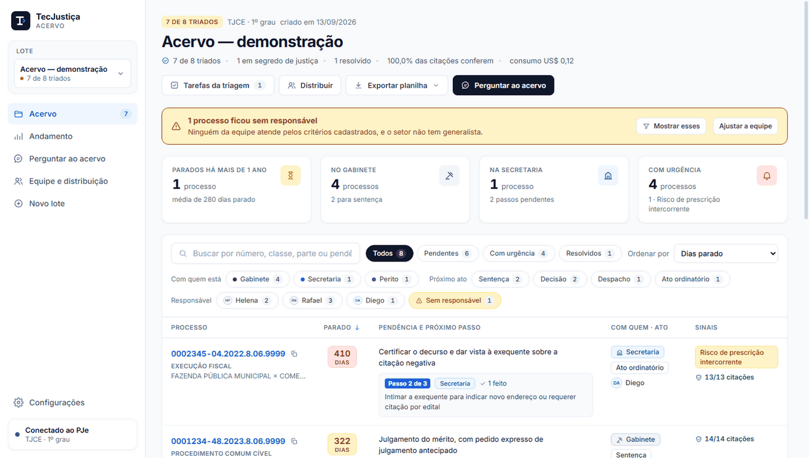
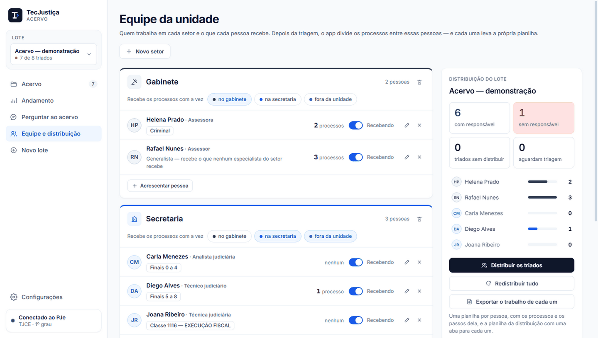
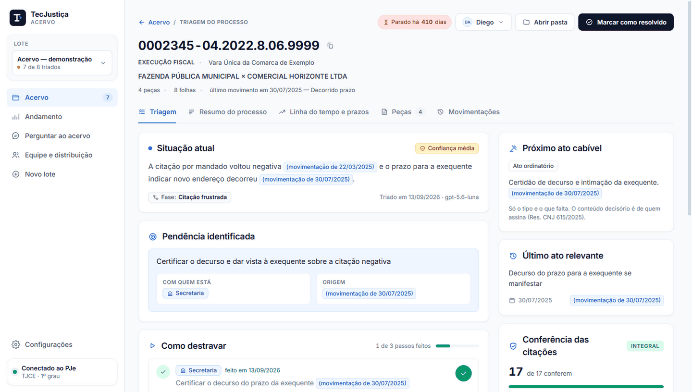
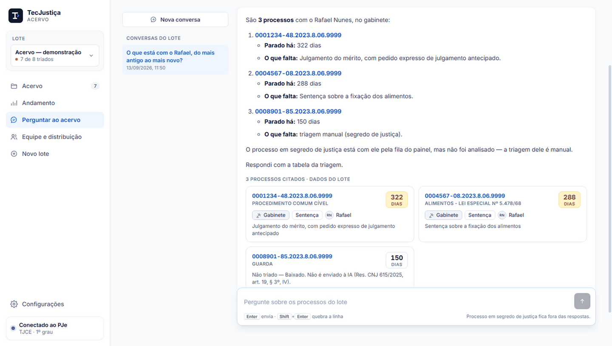

  

<h1 align="center">Kit TecJustiça para unidades judiciais</h1>

  <em>IA para ler os autos e triar o acervo do PJe — um projeto <a href="https://tecjustica.substack.com/">TecJustiça</a></em>

  
  

Duas ferramentas que se completam, do processo aberto na tela ao acervo inteiro da unidade.

| | Para quê | Como obter |
|---|---|---|
| **TecJustiça PJe** — extensão para o Chrome | Trabalhar **um processo** dentro do PJe: perguntar sobre as peças, minutar com a tese de quem assina, mapa mental, pacote de carta precatória | [Chrome Web Store](https://chromewebstore.google.com/detail/imgfakkieoijdhdpafjjlefcckbmbppm), gratuita |
| **TecJustiça Acervo** — aplicativo para Windows | Triar o **acervo inteiro**: diz por que cada processo está parado, com quem está a vez e o tipo do próximo ato, e divide o trabalho entre a equipe | Em piloto — [peça para conhecer](https://github.com/marcosmarf27/pje-ia/issues/new) |

## TecJustiça PJe — um processo de cada vez

  

Um painel de conversa sobre os autos, direto na tela do processo no PJe.

- **Você escolhe as peças** e a resposta usa só o que foi marcado, dizendo de qual peça
  e de qual folha saiu cada informação.
- **Minuta com a tese de quem assina.** Sentença e decisão só são redigidas depois de
  você informar a tese e o dispositivo, como pede a Resolução CNJ 615/2025. O texto abre num
  editor e sai em `.docx`.
- **Linha do tempo processual, mapa mental, pacote de carta precatória e `.zip` das
  peças**, com OCR das folhas digitalizadas feito no seu computador.
- **Modo sigiloso:** os dados pessoais são mascarados no seu computador antes de
  qualquer envio, e você confere o texto antes de ele sair.
- Funciona com **Claude, Gemini, GPT ou OpenRouter**, usando a sua própria chave.

## TecJustiça Acervo — o acervo inteiro

  

  

Da planilha do Painel de Acervo à pauta de cada pessoa da unidade.

- **Baixa e lê os autos** a partir da planilha do painel (ou de uma lista de números),
  com a sua sessão do PJe e OCR das folhas digitalizadas no próprio computador.
- **Triagem de cada processo:** situação atual, pendência, com quem está a vez, o
  **tipo** do próximo ato (o conteúdo da decisão é de quem assina), urgências e o
  passo a passo para destravar. Toda afirmação traz a origem — peça e folha, ou a
  movimentação — e o app confere se ela existe nos autos.
- **Equipe e distribuição.** Cadastre o gabinete, a secretaria e as pessoas de cada
  setor, e o que cada uma recebe: classe e assunto do CNJ, matéria, tipo do próximo
  ato, final do número. Depois da triagem o app divide os processos; havendo mais de
  uma pessoa possível, vai para quem tem menos, e o que ninguém atende fica em
  destaque.
- **Planilhas:** a do acervo e a de cada pessoa, com os processos e os passos pendentes.
- **Perguntar ao acervo:** converse com a triagem do lote — *"o que está com o Rafael,
  do mais antigo ao mais novo?"*.

  

  

  

As telas do Acervo usam um lote **fictício** (órgão 9999, nomes inventados).

## Privacidade

- **Extensão:** sem servidor próprio e sem telemetria. As peças vão do seu navegador
  direto ao provedor de IA que você escolher, com a sua chave. Política completa em
  [PRIVACY.md](PRIVACY.md).
- **Acervo:** os autos ficam no seu computador e só vão ao provedor de IA escolhido; a
  chave fica no cofre do Windows. Processo em **segredo de justiça** é baixado e
  **nunca** enviado à IA.

> ⚠️ Autos judiciais contêm dados pessoais e sigilosos. O uso das ferramentas é de
> responsabilidade de quem as usa, observadas as normas do tribunal, a LGPD e a
> Resolução CNJ 615/2025. A IA é apoio à leitura: a conferência e a decisão são humanas.

## Sobre este repositório

O código do kit é privado. Aqui ficam a apresentação do projeto, a política de
privacidade da extensão e o canal de suporte.

- **Relatar um problema ou pedir um recurso:** [abra uma issue](https://github.com/marcosmarf27/pje-ia/issues/new).
- **Novidades:** [TecJustiça no Substack](https://tecjustica.substack.com/).

## Apoiar o projeto

A extensão é gratuita, sem recurso pago. Se ela está sendo útil no seu trabalho:

- 🍺 **Me pague uma Heineken** — um PIX de uma vez só, no valor que você achar justo.
  Chave **(88) 99365-0420** (Nubank, Marcos Antonio Rafael da Fonseca).
- 📬 **Assine o [TecJustiça no Substack](https://tecjustica.substack.com/)** — R$ 10
  mensais, para apoiar os próximos projetos.

---

Feito com ⚖️ para quem lê autos o dia inteiro. Não afiliado ao CNJ, à Anthropic, ao Google nem à OpenAI.

