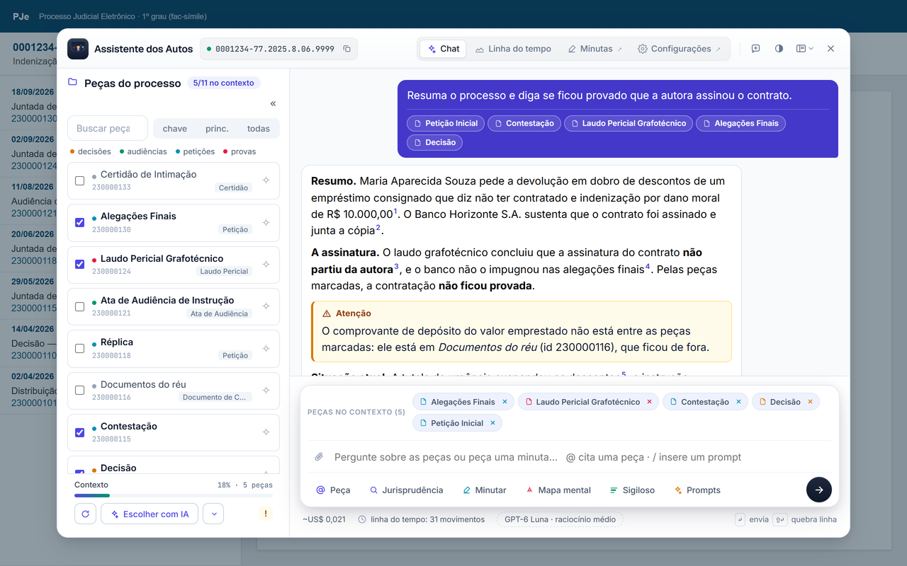
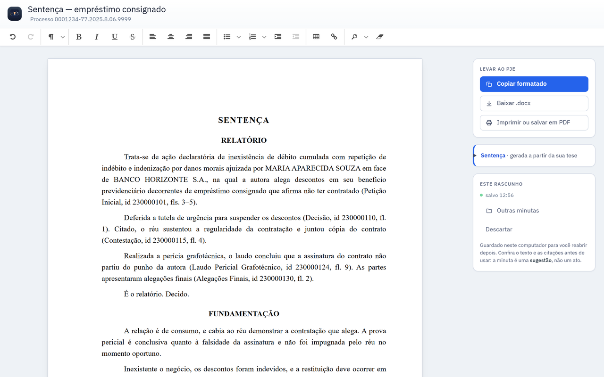
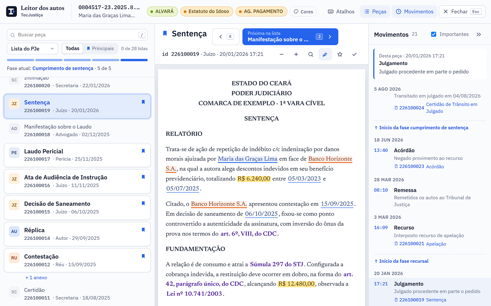
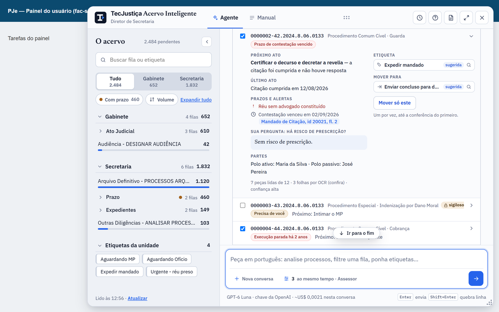
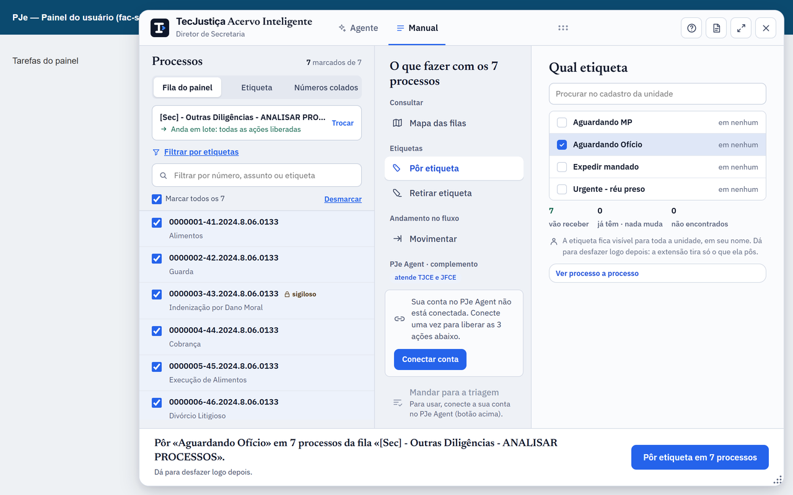

  

<h1 align="center">TecJustiça PJe</h1>

  <em>Ler, analisar e organizar os processos do PJe — dentro do próprio PJe</em>

  
  
  
  

Extensão gratuita para o Chrome que trabalha **dentro das telas do PJe** (Processo Judicial
Eletrônico), nos tribunais que usam o PJe tradicional — TJs, TRFs e outros. São três recursos
independentes:

| | Para quê | Precisa de chave de IA? |
|---|---|---|
| **Chat com IA sobre os autos** | Perguntar sobre as peças que você marca, com a peça, o id e a folha de cada afirmação; minutar, mapa mental, linha do tempo | Sim — a sua |
| **Leitor dos autos** | Ler o processo numa tela feita para isso, com destaques e movimentos | Não |
| **Acervo Inteligente** | Etiquetar e movimentar processos em lote; um agente que analisa vários processos de uma vez | Só o agente |

  

## Chat com IA sobre os autos

Na tela do processo, clique em **Analisar com IA**, marque as peças e pergunte em português.

- **A resposta usa só o que você marcou** e diz de onde saiu cada informação: a peça, o número
  dela no PJe e a folha. Quando falta uma peça que mudaria a resposta, ela avisa qual é.
- **Folhas digitalizadas também são lidas** — pelo próprio modelo de IA ou, no modo sigiloso,
  no agente e na extração de texto, por OCR no seu computador.
- **Linha do tempo processual** com as datas oficiais dos movimentos — publicação, intimação,
  decurso, trânsito —, que quase nunca viram peça com texto.
- **Minutar**: despacho, decisão ou sentença num editor de verdade, com `.docx`. Sentença e
  decisão só são redigidas depois que você informa a **tese e o dispositivo**, como pede a
  Resolução CNJ 615/2025 — a decisão é sempre de quem assina.
- **Mapa mental** do processo, **pesquisa de jurisprudência** em fontes oficiais, biblioteca
  de **prompts** e de **peças-modelo** (a minuta sai no seu formato).
- **Modo sigiloso**: nomes, CPF, CNPJ e outros dados pessoais são trocados por rótulos **no seu
  computador**, antes de qualquer envio, e você confere o texto antes de ele sair.
- **Levar os autos para fora**: as peças em `.zip`, o texto do processo em `.md` e o pacote de
  carta precatória pronto para o malote.

  

## Leitor dos autos — sem IA

Pelo botão **Ler os autos** (ou **Alt+L**): a lista de peças como no PJe, com as principais em
destaque, quem juntou cada uma e os anexos junto da petição; a peça no centro, com valores,
datas, leis e partes destacados; os movimentos ao lado. Setas trocam de peça e de folha, e o
leitor lembra onde você parou. As **etiquetas do PJe ganham cor**, no painel e nos autos.

  

## Acervo Inteligente — o acervo em lote

Pelo ícone da extensão, em qualquer tela do PJe.

- **Aba Manual**: escolha os processos de uma fila, de uma etiqueta ou de uma planilha, e
  **ponha ou retire etiquetas** e **movimente** em lote. Prévia, confirmação em dois cliques e
  conferência de cada processo depois; etiqueta tem desfazer. Funciona sem chave de IA.
- **Aba Agente**: peça em português — *"analise os 5 processos mais antigos da fila de análise:
  há risco de prescrição?"*. O agente lê as peças e os movimentos, de 1 a 7 processos ao mesmo
  tempo, e devolve para cada um a situação, o próximo ato, prazos e alertas, com a etiqueta e a
  saída sugeridas. **Ele só lê e sugere**: aplicar é sempre um clique seu.

  

  

## Começar

1. **[Instale pela Chrome Web Store](https://chromewebstore.google.com/detail/imgfakkieoijdhdpafjjlefcckbmbppm)**.
   O Chrome passa a atualizá-la sozinho.
2. Clique no ícone **TecJustiça PJe** e cole a sua chave de API de um destes provedores — o
   popup ensina a criar: [OpenAI](https://platform.openai.com/api-keys) (GPT),
   [Anthropic](https://console.anthropic.com/settings/keys) (Claude),
   [Google](https://aistudio.google.com/apikey) (Gemini) ou
   [OpenRouter](https://openrouter.ai/settings/keys) (centenas de modelos com uma chave só).
3. Abra um processo no PJe e clique em **Analisar com IA** ou em **Ler os autos**.

O uso da IA é pago diretamente ao provedor, pelo que você usar; a página de ajuda da extensão
mostra os preços. O Leitor, as cores das etiquetas e as ações em lote da aba Manual não usam IA.

A interface nova **PJe KZ**, da Justiça do Trabalho, ainda não é lida — a extensão avisa quando é o caso.

| Provedor | Bom para |
|---|---|
| **OpenAI** — GPT-6 Luna (o padrão) | O mais barato dos modelos de janela grande; autos inteiros por centavos |
| **Anthropic** — Claude | Citações por página clicáveis, que levam à peça na linha do tempo |
| **Google** — Gemini Flash | Rápido, com janela de 1 milhão de tokens |
| **OpenRouter** | Experimentar outros modelos (DeepSeek, GLM, Grok…), com o custo real informado pela API |

## PJe Agent — complemento opcional (TJCE e JFCE)

Quem tem conta no **PJe Agent**, serviço do TecJustiça, pode conectá-la nas opções da extensão
para mandar processos à triagem e ver o resultado no próprio PJe — a situação, o próximo ato, o
rascunho da minuta. **Vem desligado**, só aparece no TJCE e na JFCE, e nenhum dos recursos acima
depende dele.

## Privacidade

- **Sem servidor do desenvolvedor no caminho**: as peças vão do seu navegador direto ao provedor
  de IA que você escolheu, com a sua chave.
- **Sem telemetria, sem analytics, sem anúncios.** Chaves e preferências ficam no navegador.
- **Nada sai nem é gravado no PJe sem um gesto seu.**
- Política completa: **[PRIVACY.md](PRIVACY.md)**.

> ⚠️ Autos judiciais contêm dados pessoais e, às vezes, sigilosos. O uso é de responsabilidade de
> quem usa, observadas as normas do tribunal, a LGPD e a Resolução CNJ 615/2025. A IA é apoio à
> leitura: a conferência e a decisão são humanas.

## Suporte e novidades

- **Encontrou um problema ou tem uma ideia?** [Abra uma issue](https://github.com/marcosmarf27/pje-ia/issues/new/choose).
  Por favor, **não cole dados de processos** (nomes, CPF, número de processo em segredo de justiça).
- **O que mudou em cada versão**: dentro da extensão, em *Novidades*.
- **Blog**: [TecJustiça no Substack](https://tecjustica.substack.com/).
- Gostou? Uma [avaliação na Chrome Web Store](https://chromewebstore.google.com/detail/imgfakkieoijdhdpafjjlefcckbmbppm/reviews) ajuda outras pessoas a acharem a extensão.

## Também do TecJustiça

- **[TecJustiça Sigilo](https://github.com/marcosmarf27/tecjustica-sigilo)** — anonimiza
  documentos no seu computador antes de usá-los com IA (Windows).
- **TecJustiça Acervo** — aplicativo para Windows que tria o acervo inteiro da unidade e divide o
  trabalho da equipe. Em piloto: [peça para conhecer](https://github.com/marcosmarf27/pje-ia/issues/new/choose).

## Apoiar o projeto

A extensão é gratuita, sem recurso pago. Se ela está sendo útil no seu trabalho:

- 🍺 **Me pague uma Heineken** — um PIX de uma vez só, no valor que você achar justo.
  Chave **(88) 99365-0420** (Nubank, Marcos Antonio Rafael da Fonseca).
- 📬 **Assine o [TecJustiça no Substack](https://tecjustica.substack.com/)** — R$ 10 mensais,
  para apoiar os próximos projetos.

---

O código da extensão é privado; este repositório guarda a apresentação, a política de privacidade e o canal de suporte. As telas acima usam dados fictícios. Não afiliado ao CNJ, aos tribunais, à Anthropic, ao Google, à OpenAI nem ao OpenRouter.

